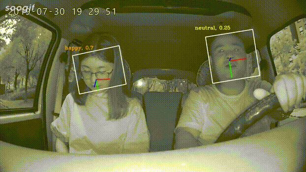

# Head Pose & Emotion

This is an example of using Baidu API to estimate the head pose and the emotion of people in the video.
 
<div align="center">
<br>
</div>

## How to use?
**First of all**, go to [Baidu AI Open Platform](https://ai.baidu.com/tech/face/detect), where you can use their API for face detection. Click `立即使用` button and after signing up and signing in, you'll get an `API Key` and a `Secret Key`. Follow the instruction in the documentation and replace both `API Key` and `Secret Key` in [baidu_api.py](https://github.com/Messier42/HeadPose-Emotion/blob/master/baidu_api.py).

**Then**, go to the build directory of this project and make a new directory called `video` where you can store your input videos. And make another directory called `result` where the output results will be stored.

**Finally**, run the command below:
```bash
python baidu_face.py --video VIDEO_PATH --output_string STRING_OF_OUTPUT_FILE --max_face_num MAXIMUM_NUMBER_OF_FACE_IN_THE_VIDEO --fps FPS_OF_THE_OUTPUT_VIDEO
```

## P.S.
You can use the API totally for free for non-commercial use. 

Part of [utils.py](https://github.com/Messier42/HeadPose-Emotion/blob/master/utils.py) comes from [Hopenet](https://github.com/natanielruiz/deep-head-pose/blob/master/code/utils.py)

**Hope you enjoy it :)**
